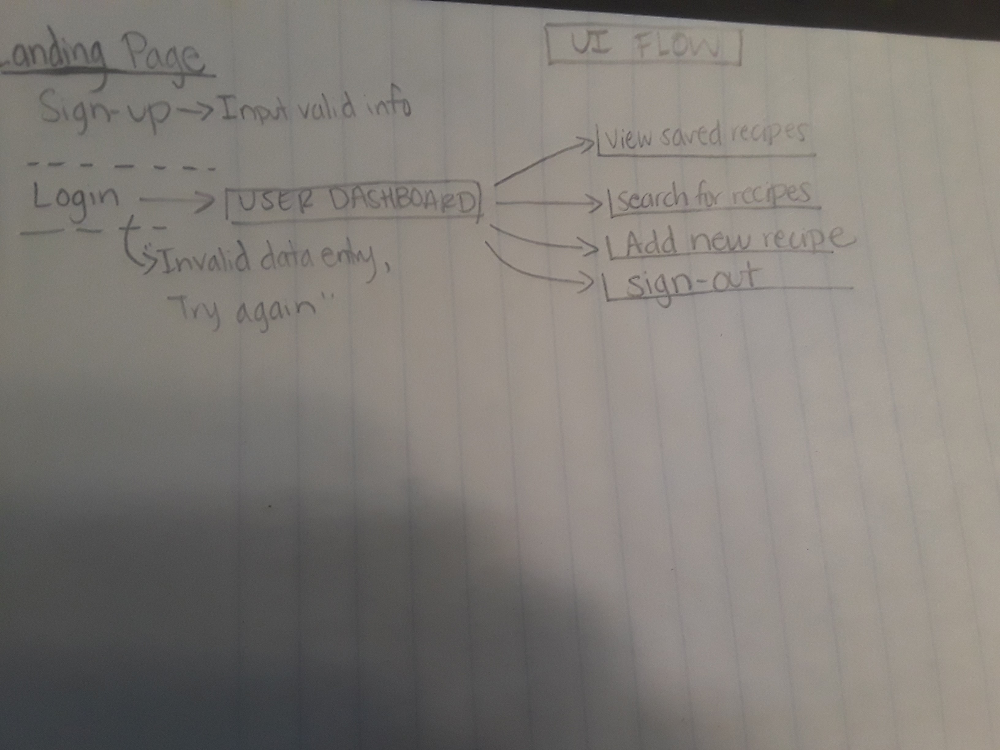
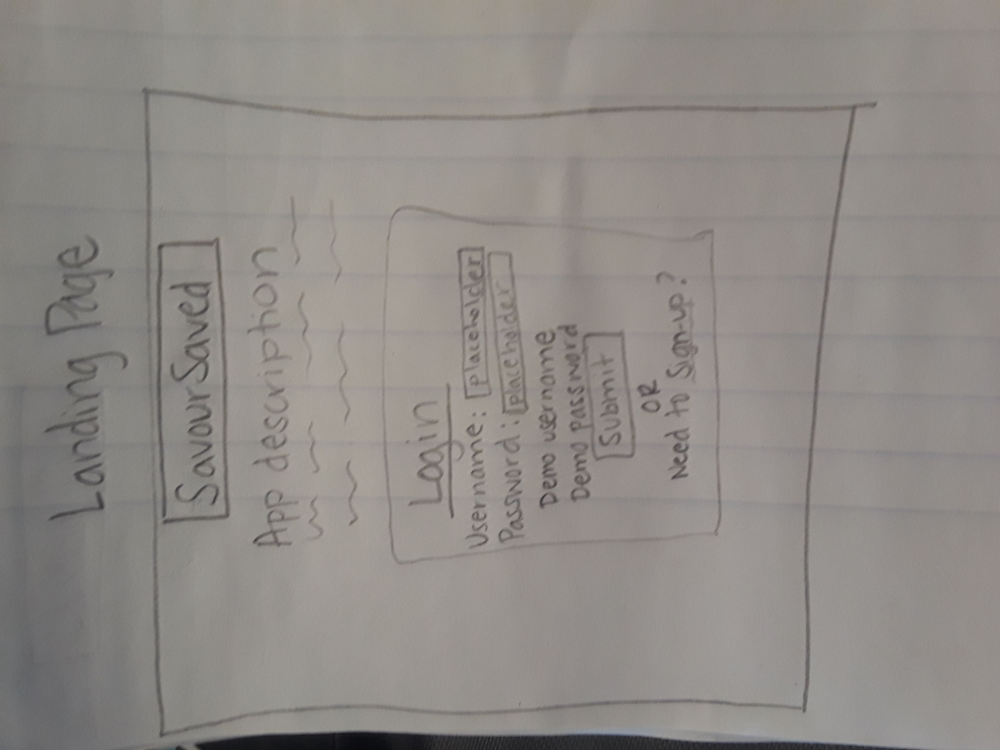

# recipe-book-fullstack-capstone
Live Pre-view available at ?....................?

# Goal & Use Case

This is a simple app where someone can search for, create his/her own recipes and save them like in a recipe book.

# Screenshots

# User Stories & Initial UX

**Landing Page**

1. As a visitor, I want to land on the main page and understand what this website is about in order for me to use it.

2. As a visitor, I want to be able to easily sign-up to be able to use the application. In any page, I should be able to sign out.

3. As a user, I want to be able to land on the dasboard, and be able to add a transaction.

4. As a user, I want to easily create new budget categories.

5. As a user, I want to create new subcategories and assign a monthly budget for each.

6. As a user, I want to see a summary of my budgeted expenses/incomes by subcategory and also a history of my transactions with totals.

# Technical stack

**Front-end**
 * HTML5
 * CSS3
 * JavaScript
 * jQuery

**Back-end**
 * NodeJS
 * Mongoose / MongoDB
 * Heroku (hosting)

**Testing**
 * Mocha & Chai
 * TravisCI

**Responsiveness**
 * The site is fully responsive on most mobile & laptop devices.
 * Tested on Chrome, Firefox & Safari.

**Security**
 * Passport
 * Bcrypt

### Version 1.1
 *Add option on the top to view budget by month
 *Users will be able to view their total expenses and income by month
 *Allow option for users to edit subcategory budgeted amounts directly

#  The typical command lines for capstone projects

## Node command lines
* npm install ==> install all node modules
* nodemon server.js ==> run node server
* npm test ==> run the tests
